# Code Along Notes

This session is a consolidation of the previous few weeks, with a push in into some more handson CSS. At the end of the
session, we should have build an example homepage similar to:
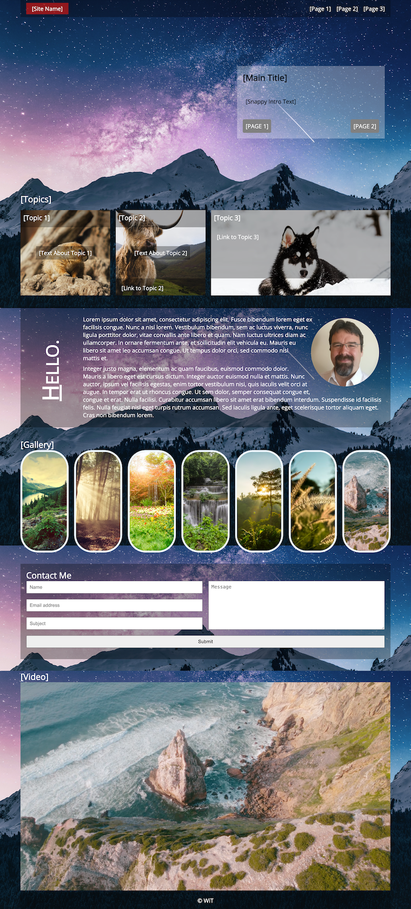

## Initial Setup (GitHub Website + Clean Local Environment)

* Create New Repo and **clone** into Clean Local Environment
  * Log in to [GitHub](https://github.com)
    
    [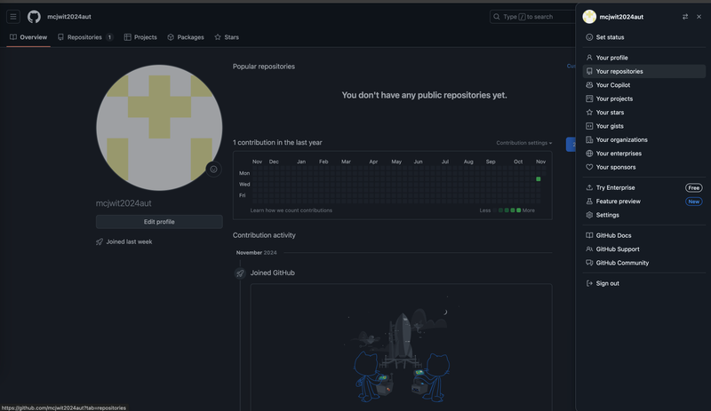](./assets/logged-in-github.png)

  * Create **New Repo**

    [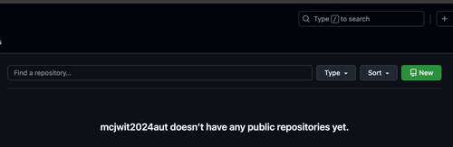](./assets/new-repo.png)

    * Any Name, Make Public, Create `README.md`

      [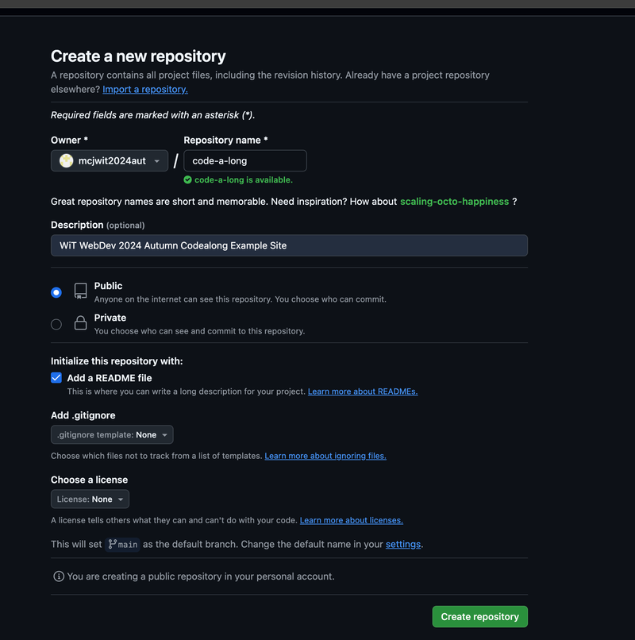](./assets/create-repo.png)

      > Any name will work and create a **Project Site** which will run in a subfolder off of the top level site `https://<owner>.github.io/<repo-name>/`, where `<owner>` is your account name (__mcjwit2024aut__ in this example) and `<repo-name>` is the name of your repository (`code-a-long`).
      >
      > For the example codealong the website will be: `https://mcjwit2024aut.github.io/code-a-long/`
      >
      > To make the website accessible on `https://<owner>.github.io/` you need give your repo a **special** name `<owner>.gihub.io` (`mcjwit2024aut.github.io` in this case). 

    * Created Repo

      [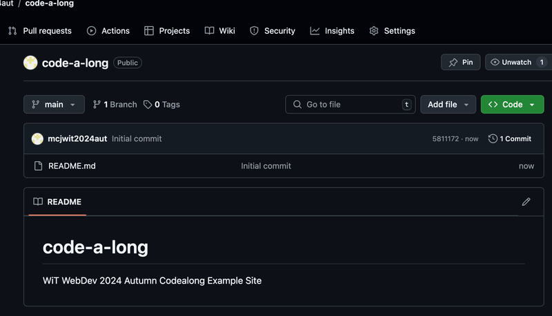](./assets/created-repo.png)    
  
  * Create new Action Pipeline to publish website
    * Create a temporary `index.html` file and **Commit Changes**:

      [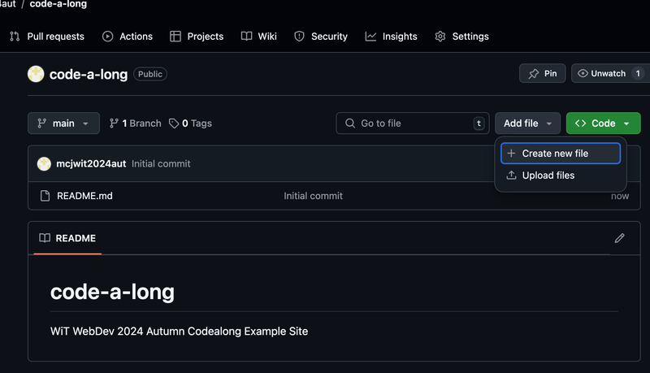](./assets/github-create-new-file.png)

      [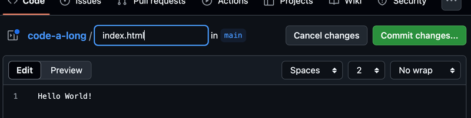](./assets/github-populate-file.png)

      [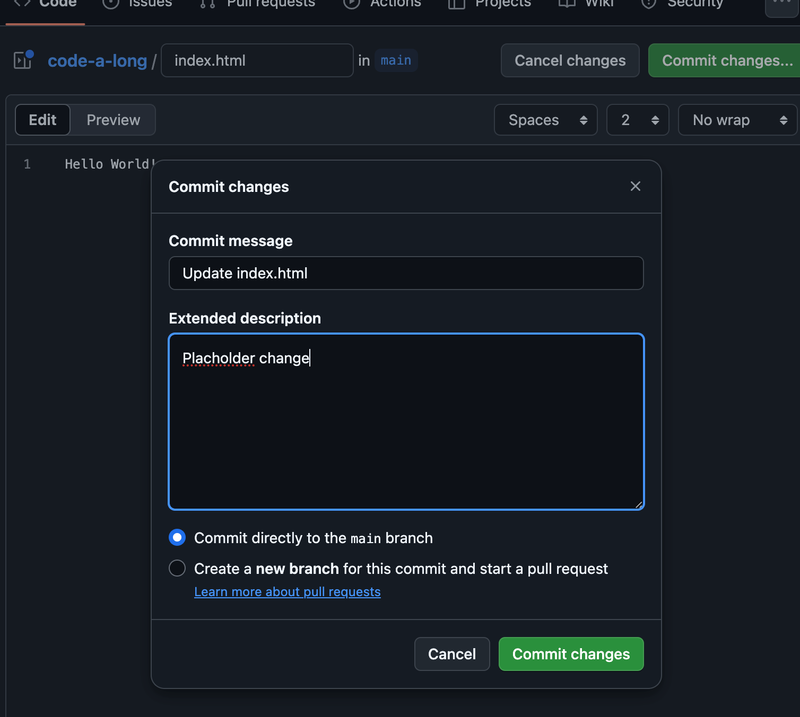](./assets/github-commit-file.png)

    * Create new **GitHub Actions** Pages Pipeline for **Static HTML**:

      [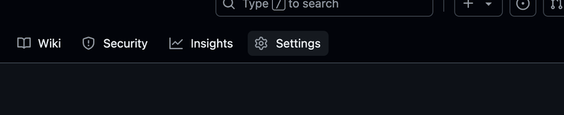](./assets/github-settings.png)

      [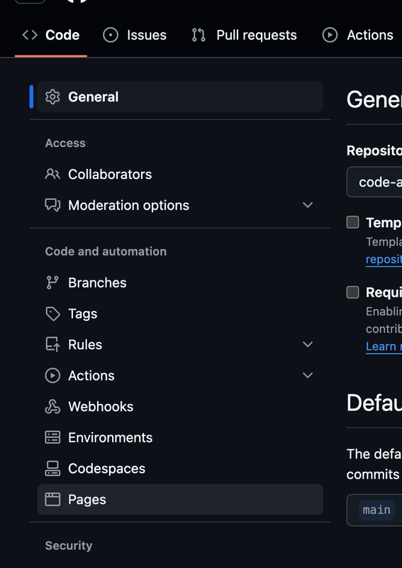](./assets/github-settings-pages.png)

      [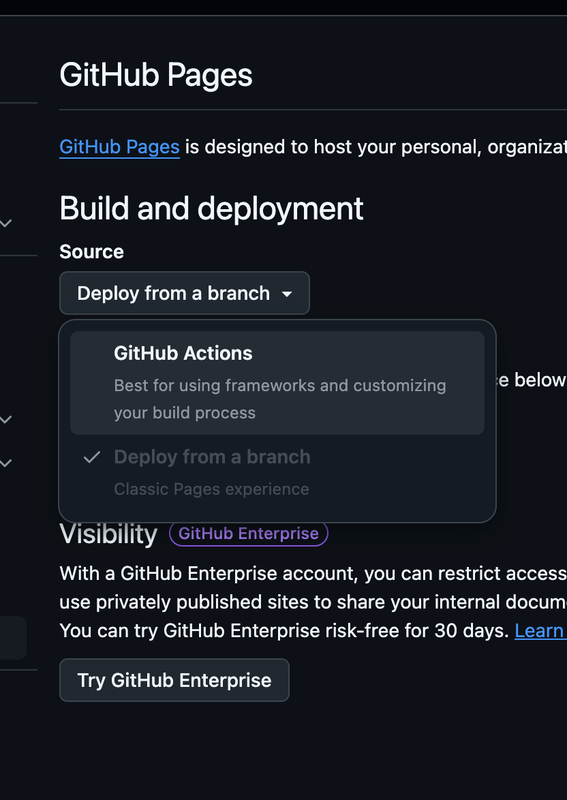](./assets/github-settings-build-and-deployment.png)

      [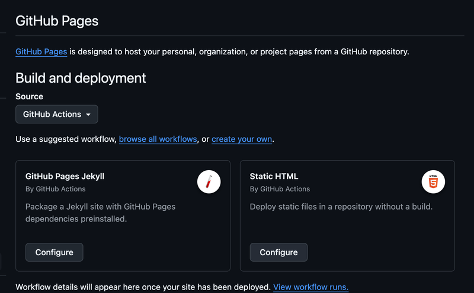](./assets/github-settings-pages-static-html.png)

      [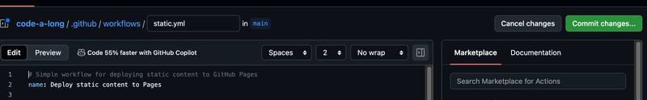](./assets/github-settings-pages-pipeline.png)

      [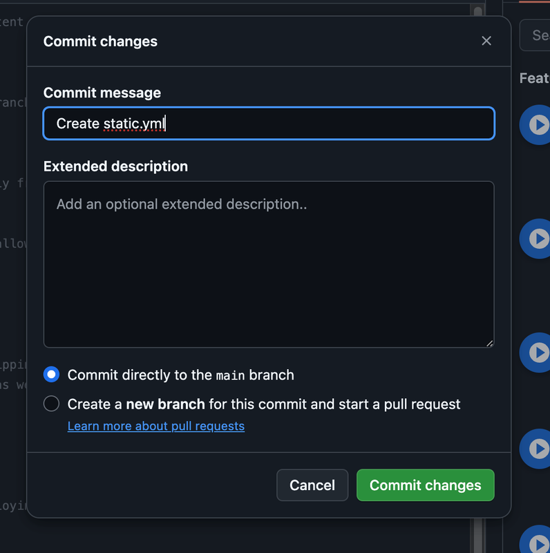](./assets/github-settings-pages-pipeline-commit.png)

    * Verify publishing is working by viewing **Actions** => **Workflows**:

      [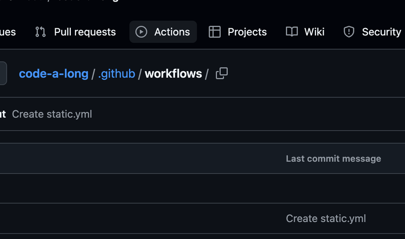](./assets/github-actions.png)

      [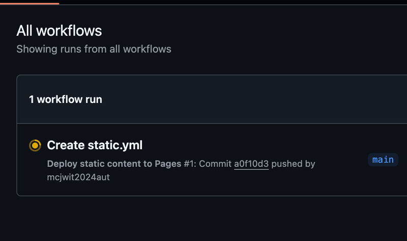](./assets/github-actions-workflows.png)

      [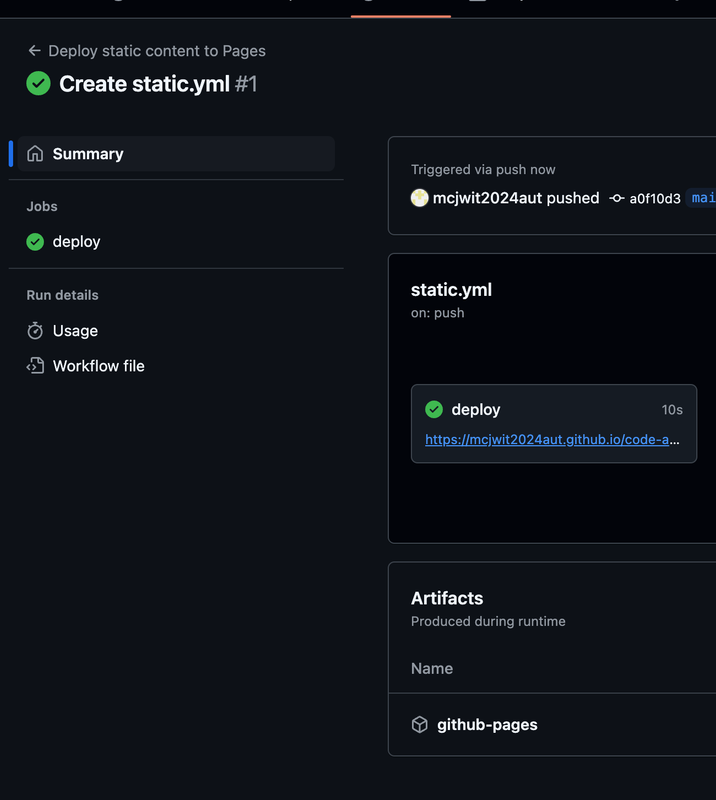](./assets/github-actions-deployment-complete.png)

      [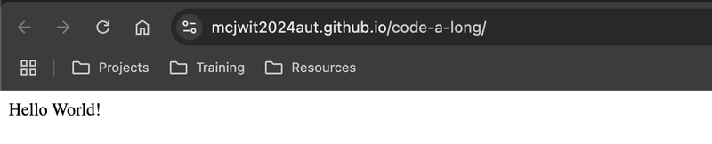](./assets/github-actions-published.png)

* Clean VSCode Setup
  * Install [VsCode](https://code.visualstudio.com/download) and [Git](https://git-scm.com/downloads)

    > ### Tutors/Advanced Users who don't want to interfere with an existing VS Code install 
    >
    > Alternatively, a `docker` container for `code-server` can be started pre-installed and entirely blank (requires [Docker Desktop](https://www.docker.com/products/docker-desktop/)):
    > ```bash
    > docker run -d \
    >   --name=code-server \
    >   -e PUID=1000 \
    >   -e PGID=1000 \
    >   -e TZ=Etc/UTC \
    >   -e PASSWORD=password `#optional` \
    >   -e HASHED_PASSWORD= `#optional` \
    >   -e SUDO_PASSWORD=password `#optional` \
    >   -e SUDO_PASSWORD_HASH= `#optional` \
    >   -e PROXY_DOMAIN=code-server.my.domain `#optional` \
    >   -e DEFAULT_WORKSPACE=/config/workspace `#optional` \
    >   -p 8443:8443 \
    >   -p 3000:3000 \
    >   -p 5500:5500 \
    >   -v ~/code-server/config:/config \
    >   --restart unless-stopped \
    >   lscr.io/linuxserver/code-server:latest
    > ```
    > 
    > `8443` is the default Code Server UI port
    > `3000` is the "Live Preview" port
    > `5500` is the "Live Server" port
    > 
    > Containerised VS Code is available at: [Code Server](http://localhost:8443/?folder=/config/workspace) 

  * Open VsCode
  * Create new Profile (to ensure no extension or settings conflicts, etc)

    [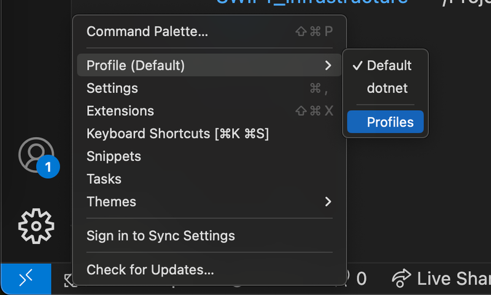](./assets/vscode-profiles.png)

    [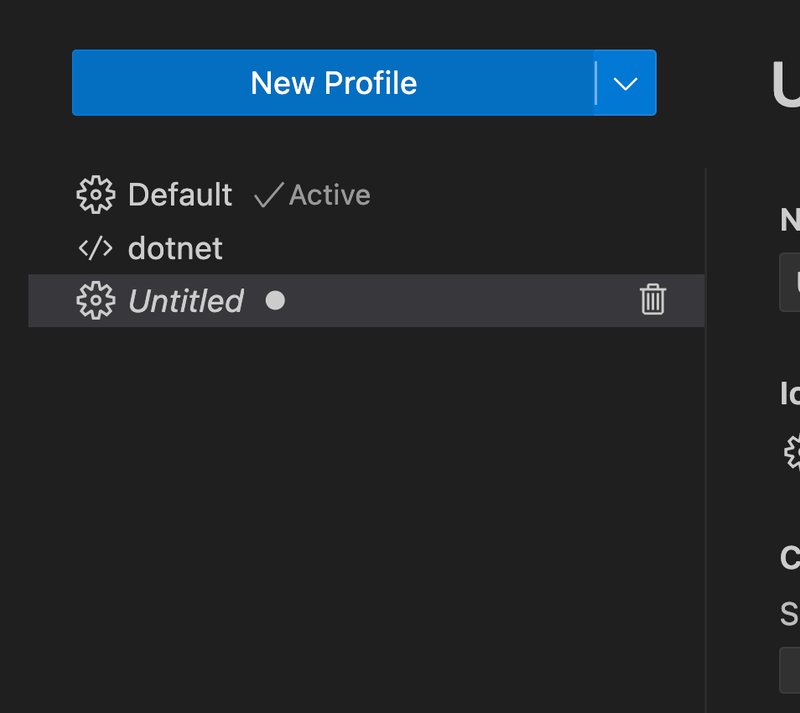](./assets/vscode-profiles-new.png)

    [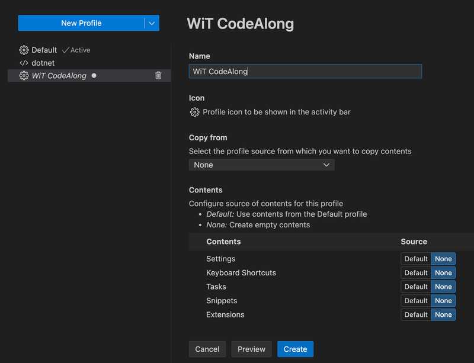](./assets/vscode-profiles-new-name.png)

    [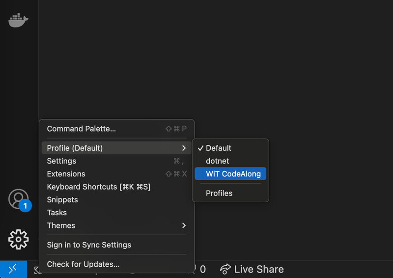](./assets/vscode-profiles-switch.png)

* Configure `git` in VS Code Terminal

  [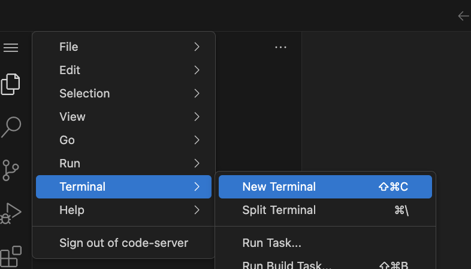](./assets/vscode-new-terminal.png)
  [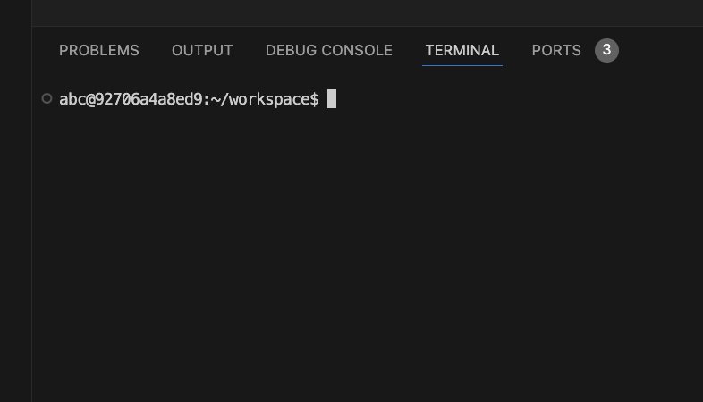](./assets/vscode-new-terminal-window.png)

  ```bash
  git config --global user.name "<first_name> <last_name>"
  git config --global user.email "<your@email.com>"
  ```

  Example:
  
  ```bash
  abc@92706a4a8ed9:~/workspace$ git config --global user.name "Martin Jarvis"
  abc@92706a4a8ed9:~/workspace$ git config --global user.email "martin.jarvis@test.com"
  abc@92706a4a8ed9:~/workspace$ git config --global -l
  user.name=Martin Jarvis
  user.email=martin.jarvis@test.com
  ```

  [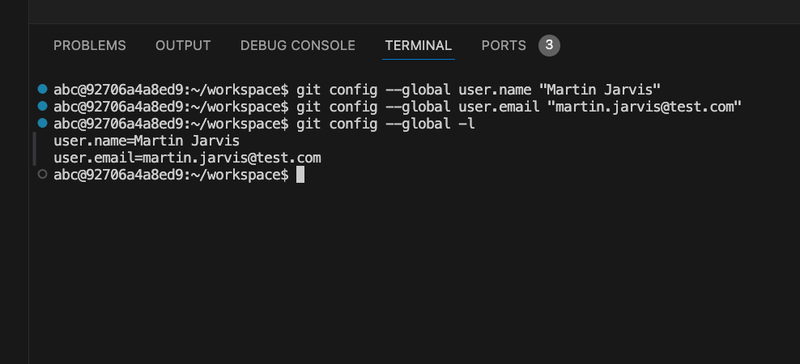](./assets/vscode-terminal-git-config.png)

* Clone Git Repo using GitHub VS Code integration (doesn't work on many corporate laptops)

  * Select `Git: Clone` from the command palette (can be access by `View` -> `Command Palette`)
    
    [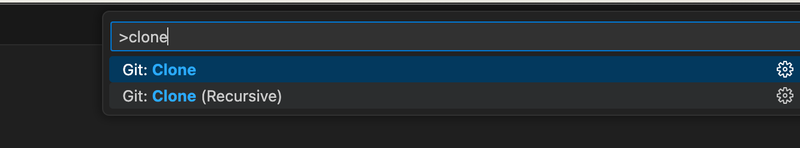](./assets/vscode-git-clone.png)

  * Login to GitHub via VS Code integration;
  
    [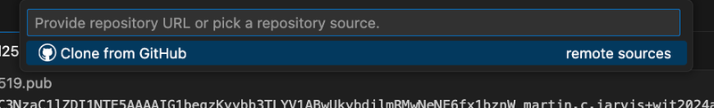](./assets/vscode-clone-from-github.png)

    [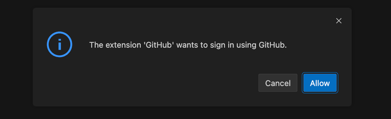](./assets/vscode-clone-from-github-permission.png)

    [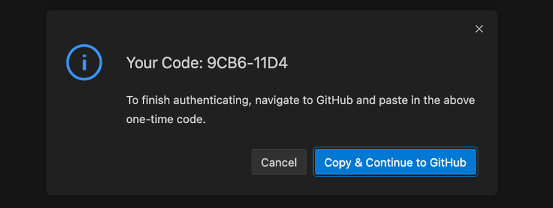](./assets/vscode-clone-from-github-login.png)

    [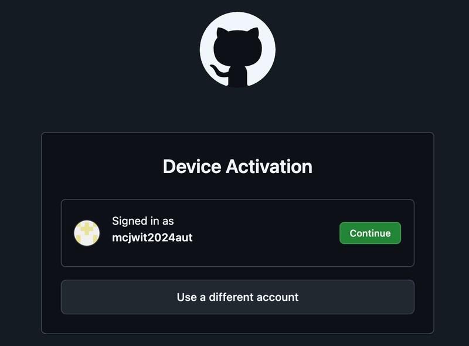](./assets/vscode-clone-from-github-approve.png)

    Enter Code

    [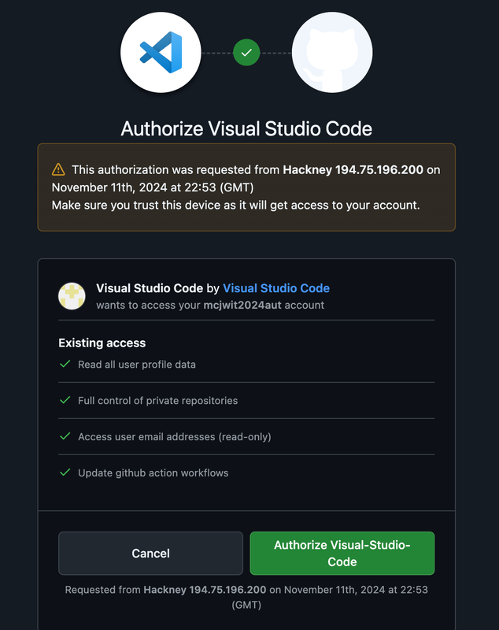](./assets/vscode-clone-from-github-auth.png)

    [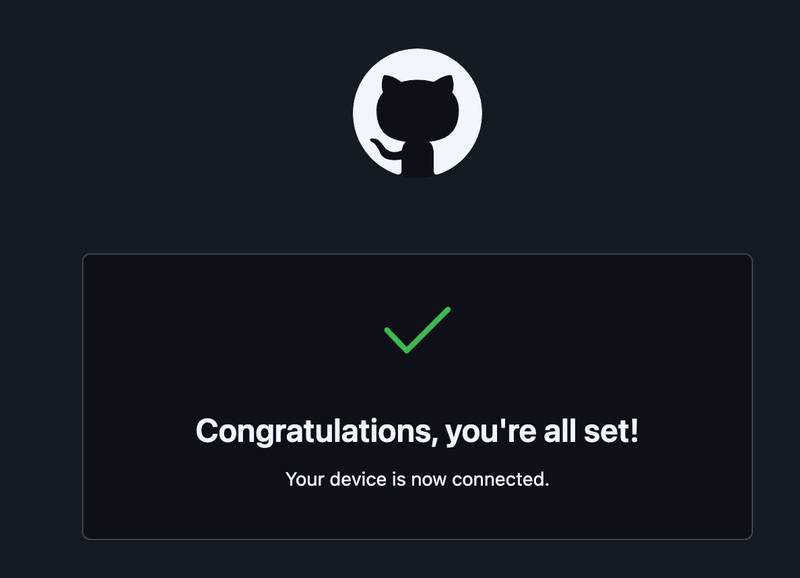](./assets/vsclode-clone-from-github-success.png)

    Return to VS Code

  * If behind a firewall VS Code may fail with an error similar to:

    [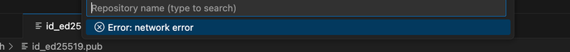](./assets/vscode-clone-from-github-network-error
.png)  


* Setup `git` to use your GitHub account vis SSH - ** this is tricky (but only needs to be done once!)** [Official Guide - Create SSH Key](https://docs.github.com/en/authentication/connecting-to-github-with-ssh/generating-a-new-ssh-key-and-adding-it-to-the-ssh-agent), [Official Guide - Add SSH Key](https://docs.github.com/en/authentication/connecting-to-github-with-ssh/adding-a-new-ssh-key-to-your-github-account)
  * Generate a new SSH Key using `ssh-keygen` in terminal (this needs to use the email address used for your [GitHub account](https://github.com/settings/emails)):

    `ssh-keygen -t ed25519 -C "martin.c.jarvis+wit2024aut@googlemail.com"`

    Example:

    ```bash
    abc@92706a4a8ed9:~/workspace$ ssh-keygen -t ed25519 -C "martin.c.jarvis+wit2024aut@googlemail.com"
    Generating public/private ed25519 key pair.
    Enter file in which to save the key (/config/.ssh/id_ed25519): 
    Enter passphrase (empty for no passphrase): 
    Enter same passphrase again: 
    Your identification has been saved in /config/.ssh/id_ed25519
    Your public key has been saved in /config/.ssh/id_ed25519.pub
    The key fingerprint is:
    SHA256:rRnyeBhX0pWViRYnAadeWqUeZUPxi/tyFUM2PLomiPQ martin.c.jarvis+wit2024aut@googlemail.com
    The key's randomart image is:
    +--[ED25519 256]--+
    |          ..*B@+ |
    |         . ++BoO |
    |        . +.= + +|
    |       . = = o.o.|
    |      + S = ....o|
    |       O E . o. .|
    |      o =   o.  .|
    |       .     ... |
    |              o. |
    +----[SHA256]-----+
    ```
  * Ensure the `ssh-agent` is running:

    `eval "$(ssh-agent -s)"`

    Example:

    ```bash
    bc@92706a4a8ed9:~/workspace$ eval "$(ssh-agent -s)"
    Agent pid 6291
    ```

  * Create `~/.ssh/config` with `touch ~/.ssh/config`
  * Open `~/.ssh/config` in vscode, add config and save

    [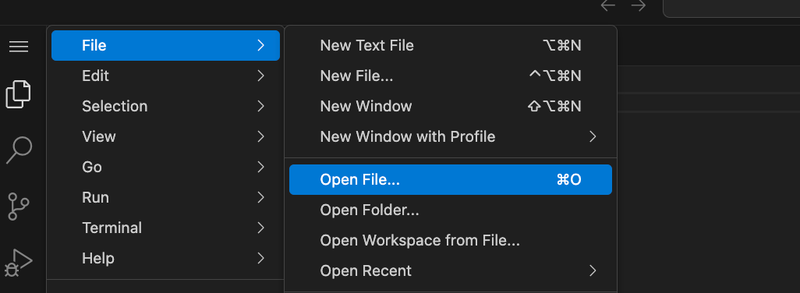](./assets/vscode-ssh-open.png)
    [](./assets/vscode-ssh-config.png)
    [](./assets/vscode-ssh-empty.png)

    ```plain
    Host github.com
      AddKeysToAgent yes
      IdentityFile ~/.ssh/id_ed25519
    ```

    Save and close `~/.ssh/config`
  * Add new SSH key to Agent

    `ssh-add ~/.ssh/id_ed25519`

    Example:

    ```bash
    abc@92706a4a8ed9:~/workspace$ ssh-add ~/.ssh/id_ed25519
    Identity added: /config/.ssh/id_ed25519 (martin.c.jarvis+wit2024aut@googlemail.com)
    ```

  * Add New Key to GitHub

      * Copy contents of `~/.ssh/id_ed25519` to clipboard (open in VS Code, select all and Copy)
      * Open [SSH and GPG Keys](https://github.com/settings/keys) in your GitHub Profile

        [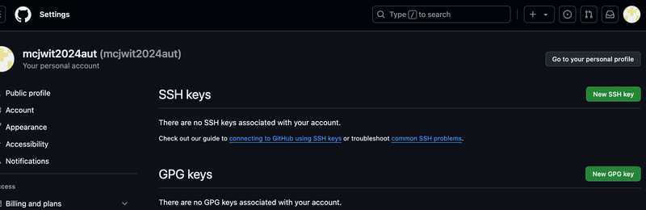](./assets/github-ssh-keys.png)
      
      * Click `New Key`

        [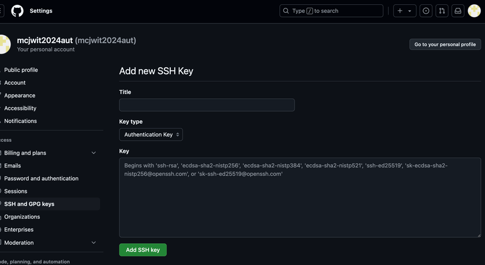](./assets/github-ssh-add-key.png)
      
      * Give your key a memorable name and paste the contents of `~/.ssh/id_ed25519` into the `key` field

        [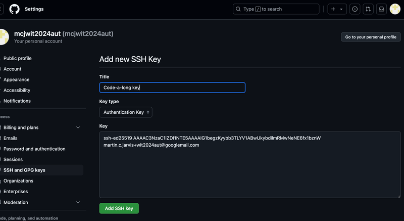](./assets/github-ssh-completed-key.png)

      * Successfully added key

        [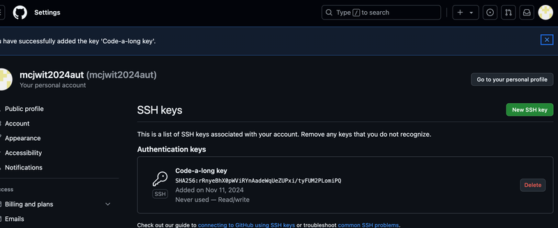](./assets/github-ssh-added-key.png)

* Setup VSCode Workspace
    * Install Extension
        * [Live Preview](https://marketplace.visualstudio.com/items?itemName=ms-vscode.live-server)
        * Open the `Settings`
          
        * Toggle to `Workspace` Settings and filter to `livePreview.serverRoot`
          
          Set to `/src`
        * This should create a new file `.vscode/settings.json` with the contents:
          ```json
          {
              "livePreview.serverRoot": "/src"
          }
          ```
          
        * The Live Preview extension and published website should now work in the same way

      > The [Live Server](https://marketplace.visualstudio.com/items?itemName=ritwickdey.LiveServer) extension can be
      configured in a similar way using: `liveServer.settings.root`
      > 

## Setup Template with Wireframe CSS
* Setup `./src` folder
    * Basic `index.html` ([Final](./src/1.%20boilerplate.html))
      ```html
      <!DOCTYPE html>
      <html lang="en">
      <head>
          <meta charset="UTF-8" />
          <meta name="viewport" content="width=device-width,initial-scale=1.0" />
          <title>[Page Name] - [Site Name]</title>
      </head>
      <body>
        <h1>Ta-da!</h1>
        <p>You've successfully launched your first page!</p>
      </body>
      </html>
      ```
* Create page scaffolding:
  
* Update `index.html` `<body>` content to be:
  ```html
    <header></header>
    <main>
        <section></section>
        <section></section>
    </main>
    <footer></footer>
  ```
* Create a new `styles/styles.css` file
* Add temporary style:
  ```css
  header,
  main,
  aside,
  footer,
  section,
  article {
    border: 1px solid black;
    padding: 2px;
    margin: 2px;
    min-height:20px;
    min-width:20px;
  }
  ```
  > Note: the same style directives can be applied to multiple CSS Selectors by seperating the selectors with a `,`
  comma.

  >
  Note: [border](https://developer.mozilla.org/en-US/docs/Web/CSS/border), [padding](https://developer.mozilla.org/en-US/docs/Web/CSS/padding), [margin](https://developer.mozilla.org/en-US/docs/Web/CSS/margin), [min-height](https://developer.mozilla.org/en-US/docs/Web/CSS/min-height), [min-width](https://developer.mozilla.org/en-US/docs/Web/CSS/min-width)
* Link the stylesheet `<link rel="stylesheet" href="styles/styles.css" />`
* [Final](./src/2.%20wireframe.html):

## Responsive Layout CSS

* Setup simple Reset CSS
  ```css
  * {
    padding: 0;
    margin: 0;
    box-sizing: border-box;
  }
  
  html,
  body {
    height: 100vh;
    font-family: Arial, Helvetica, sans-serif;
  }
  ```
  > Note: Removes any default padding and margin settings from the Browser stylesheet. Also, set up an unoffensive
  font-family for the page.  `height: 100vf` directive sets the height of the body to be the height of the browser
  window.

  >
  Note: [box-sizing](https://developer.mozilla.org/en-US/docs/Web/CSS/box-sizing),[font-family](https://developer.mozilla.org/en-US/docs/Web/CSS/font-family),[CSS Units](https://www.w3schools.com/cssref/css_units.php)
* Configure Responsive Layout CSS
    * Add Size Variables:
      ```css
      :root {
        --min-width: 15rem;
        --header-height: 3rem;
      }
      ```
      > Note: `:root` is a special selector meaning the root of the entire HTML document.
      > [CSS Variables](https://developer.mozilla.org/en-US/docs/Web/CSS/Using_CSS_custom_properties) can be named
      whatever you like but must be prefixed with `--`. They're useful for when you want to have a tweakable value used
      in multiple rules.
    * Configure the overall grid:
      ```css
      body {
        min-width: var(--min-width);
        max-width: calc(var(--min-width) * 3);
        margin: 0 auto;
        display: grid;
        grid-template-rows: var(--header-height) auto var(--header-height);
      }
      ```
      > Note: [display: `grid`](https://www.w3schools.com/css/css_grid.asp).  `var(--header-height)` uses the variable
      value to set the top and bottom rows heights.  [auto] makes the middle (`<main>`) element take up the remainder of
      the vertical space.
    * Setup centered responsive column:
      ```css
      body>main {
        min-width: var(--min-width);
        max-width: 70%;
        width: 100%;
        margin: 0 auto;
      }
      ```
      > Note: `margin: 0 auto;` is a common way to centrally place an element with a set `width`.
    * Assign rows to top level elements:
      ```css
      body>header {
        grid-row: 1;
      }
  
      body>main {
        grid-row: 2;
      }
  
      body>footer {
        grid-row: 3;
      }
      ```
    * [Final](./src/3.%20layout.html):

## Setup Header and Footer

* Add the Logo and Nav elements:
  ```html
  <a class="logo" href="index.html">[Site Name]</a>
  <nav>
      <a href="#">[Page 1]</a>
      <a href="#">[Page 2]</a>
      <a href="#">[Page 3]</a>
  </nav>
  ``` 
* Setup the CSS:
  ```css
  /* Add to :root */
  :root {
    --large-padding: 1rem;
  }
  /* New rule */
  body>header,
  body>footer {
    display: flex;
    justify-content: space-between;
    align-items: center;
    flex-shrink: 0;
    padding: var(--large-padding);
  }
  ```
  > Note: [display: flex](https://www.w3schools.com/css/css3_flexbox.asp) allows you to easily distribute elements
  within a container in either a `row` or `column`. This is a very useful tool -
  see [Flexbox Froggy](https://flexboxfroggy.com/) for a neat tutorial.
  [justify-content](https://developer.mozilla.org/en-US/docs/Web/CSS/justify-content) how to distribute the child
  elements within the container.
  [align-items](https://developer.mozilla.org/en-US/docs/Web/CSS/align-items) positions the elements within the
  container.
  [flex-shrink](https://developer.mozilla.org/en-US/docs/Web/CSS/flex-shrink) controls whether elements can be
  automatically shrunk (also: [flex-grow](https://developer.mozilla.org/en-US/docs/Web/CSS/flex-grow))
* Add Footer HTML:
  ```html
  <p>&copy; WiT</p>
  ```
* Add Override CSS to center the content
  ```css
  body > footer {
    justify-content: center;
  }
  ```
* [Final](./src/4.%20header+footer.html):

## Basic Theme

* Add basic color scheme variables:
  ```css
  :root {
    --text: white;
    --background: blue;
    --logo-button:  rgba(200, 10, 10, 0.7);
    --background-fade: rgba(0,0,0,0.3);
  }
  ```
* Update the `body` CSS Rule:
  ```css
  body {
    ...
    color: var(--text);
    background-color: var(--background);
 
  }
  ```
* Fix Links to appear like text:
  ```css
  a,
  a:hover,
  a:visited {
    color: var(--text);
    text-decoration: none;
  }
  
  a:hover {
    text-decoration: underline;
  }
  ```
  > Note: [text-decoration](https://developer.mozilla.org/en-US/docs/Web/CSS/text-decoration)
* Style the Site Logo:
  ```css
  body > header > a {
    background-color: var(--logo-button);
    height: calc(var(--header-height) / 2);
    padding: var(--large-padding);
    display: flex;
    align-items: center;
    justify-content: center;
  }
  ```
  > Note: [`calc`](https://www.w3schools.com/cssref/func_calc.php) allows CSS to use dynamically calculated values. This
  is good for responsive layouts.
* Style `header` and `footer`:
  ```css
  body>header,
  body>footer {
    background-color: var(--background-fade);
  }
  ```
* [Final](./src/5.%20theme.html):

## Hero Module

* Find an appropriate image from [unsplash](https://unsplash.com/). Download to `./images` and rename to
  `splash-background.jpg` (`jpg`` imagesmay be different depending on the image!).
* Add the Hero Module signpost markup (replacing the first `<section>`):
  ```html
  <section class="hero" style="--hero-splash-image: url('../images/splash-background.jpg')">
      <header><h1>[Main Title]</h1></header>
      <main><p>[Snappy Intro Text]</p></main>
      <footer><a href="#">[Page 1]</a> <a href="#">[Page 2]</a></footer>
  </section>
  ```
  > Note: We're defining the background image in HTML rather than CSS so the styling can be resused across multiple
  pages using the same stylesheet. It's generally a **bad practice** to use a `style` attribute.

  > Note: You _could_ do something similar with an `` tag, but semantically these images are purely decorative by
  using an `img` element we'd be implying that the image was meaningful to the content, rather than just a pretty
  background.
* Style Hero Module:
    * Add new variables:
  ```css
  :root {
    --foreground-fade: rgba(255,255,255,0.3);
    --accent-text: black;
    --button: gray;

    --small-padding: calc(var(--large-padding) / 2);
  }
  ```
    * Add styling to module content to create right aligned "content" area showing off the background image:
  ```css
  section.hero {
    min-height: var(--hero-height);
    padding: var(--large-padding);
    display: flex;
    flex-direction: column;
    justify-content: center;
    align-items: flex-end;
    color: var(--accent-text);
    position:relative;
  }
  
  section.hero > * {
    background-color: var(--foreground-fade);
    padding: var(--large-padding);
    min-width: calc(
      var(--min-width) - 4 * var(--large-padding)
    ); /* 30rem - 2x( 1rem main padding + 1rem   section padding )*/
  }
  ```  
  > Note: [`position:relative;`](https://developer.mozilla.org/en-US/docs/Web/CSS/position) will mean any child elements
  that are `absolute`ly positioned will be relative to this element.

  > Note: `>` in a CSS selector means child and `*` matches any element, so `section.hero > *` will match any element
  which is an immediate child of the `section.hero`.
    * Style buttons in the footer:
  ```css
  section.hero footer {
    display: flex;
    justify-content: space-between;
  }
  
  section.hero footer a {
    text-transform: uppercase;
    background-color: var(--button);
    padding: var(--small-padding);
    border-radius: calc(var(--small-padding) / 2);
  }
  ```
    * Display the **hero** background image:
  ```css
  section.hero::before {
    content: "";
    z-index: -1;
    position:absolute;
    top: 0;
    bottom: 0;
    left: 0;
    right: 0;
    background-image: var(--hero-splash-image);
    background-position: center;
    background-repeat: no-repeat;
    background-size: cover;
  }
  ```
  > Note: [z-index](https://developer.mozilla.org/en-US/docs/Web/CSS/text-decoration) allows you to move elements to
  different layers. In this case -1 moves the element behind the normal elements.
* Optional: Full page hero image:
  ```css
  section.hero.full::before {
    position: fixed;
  }
  ```
  > Note: This rull will apply if the `full` class is applied to the `hero` section, and will make to positioning of the
  background image relative to the viewport of the browser.
* Comment out the wireframe CSS
* [Final](./src/6.%20hero.html):

## Signpost Module

* Restore Wireframe CSS and add Foreground Fade Rule
  ```css
  body > main {
    background-color: var(--foreground-fade);
  }
  ```
* Setup Module Layout
  ```html
  <section class="signposts">
      <header>
          <h2>[Topics]</h2>
      </header>
      <main>
          <article></article>
          <article></article>
          <article></article>
      </main>
  </section>
  ```
* Layout CSS for module
  ```css
  :root {
    --signpost-height: calc(var(--hero-height)/2);
  }

  section.signposts {
    flex: 1 0 auto;
    display: grid;
    grid-template-rows: var(--header-height) auto;
    min-height: var(--signpost-height);
  }
  ```
* Layout CSS for Signposts in module
  ```css
  section.signposts > main {
    display: grid;
    grid-gap: var(--large-padding);
    grid-template-columns: 1fr 1fr 2fr;
  }
  ```
* Select Three signpost images and save the urls:
  
* Add markup for simple signpost:

```html
<article>
  <header>
    <h3>[Topic 2]</h3>
  </header>
  <main>
    <p>[Text About Topic 2]</p>
  </main>
  <footer>
    <p><a href="#">[Link to Topic 2]</a></p>
  </footer>
</article>
```

* Add styling to layout each signpost module consistently:

```css
section.signposts article,
section.signposts article > a {
  display: grid;
  grid-template-rows: var(--header-height) auto var(--header-height);
}

section.signposts article > header {
  grid-row: 1;
}

section.signposts article > main {
  grid-row: 2;
}

section.signposts article > footer {
  grid-row: 3;
}
```

> Note: without the `grid-row` directives elements would just stack on top of each other. This way `header` is always at
> top, `footer` is always at the bottom, `main` is in the middle.

* Style article text overlays:

```css
section.signposts article main {
  display: flex;
  justify-content: center;
  align-items: center;
} 

section.signposts article header,
section.signposts article footer,
section.signposts article main p {
  padding: var(--small-padding);
  background-color: var(--background-fade);
}
```

* Add `--bgImage` variable to signpost to the `article`:

```html
<article style="--bgimage:url('https://images.unsplash.com/photo-1665131974572-ea0ecee58cbc?ixlib=rb-4.0.3&ixid=MnwxMjA3fDB8MHxwaG90by1wYWdlfHx8fGVufDB8fHx8&auto=format&fit=crop&w=1740&q=80')">
```

* Add global CSS helper rule:

```css
[style^="--bgimage"] {
  background-image: var(--bgimage);
  background-position: center;
  background-repeat: no-repeat;
  background-size: cover;
}
```

> Note: this _could_ be scoped to `section.signposts` but it's a generally helpful rule

* Setup a `header` and `footer` note signpost:
  ```html
  <article style="--bgimage:url('https://images.unsplash.com/photo-1656666271549-3c2046815f11?ixlib=rb-4.0.3&ixid=MnwxMjA3fDB8MHxwaG90by1wYWdlfHx8fGVufDB8fHx8&auto=format&fit=crop&w=928&q=80');">
    <header>
      <h3>[Topic 3]</h3>
    </header>
    <footer>
      <p><a href="#">[Link to Topic 3]</a></p>
    </footer>
  </article>
  ```
* Setup a signpost to be fully clickable:
  ```html
  <article style="--bgimage:url('https://images.unsplash.com/photo-1667757699107-62841bd54178?ixlib=rb-4.0.3&ixid=MnwxMjA3fDB8MHxwaG90by1wYWdlfHx8fGVufDB8fHx8&auto=format&fit=crop&w=774&q=80')">
    <a href="#">
      <header>
        <h3>[Topic 1]</h3>
      </header>
      <main>
        <p>[Text About Topic 1]</p>
      </main>
    </a>
  </article>
  ```
* Clickable CSS Signpost:
  ```css
  :root {
    --signpost-highlight-fade: rgba(255,255,255,0.5);
  }

  section.signposts article {
    position: relative;
  }

  section.signposts article > a {
    position: absolute;
    top: 0;
    bottom: 0;
    left: 0;
    right: 0;
  }

  section.signposts article > a:hover {
    background-color: var(--signpost-highlight-fade);
  }

  section.signposts article > a > header {
    grid-row: 1;
  }

  section.signposts article > a > main {
    grid-row: 2;
  }

  section.signposts article > a > footer {
    grid-row: 3;
  }
  ```
* [Final](./src/7.%20signpost.html):

## Seperate Theme from Layout

* Move all the colour variables to a new CSS `theme.css` File:
  ```css
  :root {
    --text: white;
    --background: blue;
    --logo-button: rgba(200, 10, 10, 0.7);
    --background-fade: rgba(0, 0, 0, 0.3);

    --foreground-fade: rgba(255, 255, 255, 0.3);
    --accent-text: black;
    --button: gray;

    --signpost-highlight-fade: rgba(255,255,255,0.5);
  }
  ```
* Add a new link to the new CSS file before the usual `styles.css`
* Duplicate the `theme.css` to a new file and update the colours.
* Switch between the theme files to see the changes.
* [Final](./src/8.%20seperate%20theme.html)

## Additional Notes

Useful Urls:

* [Flat UI Colors](https://flatuicolors.com/)
* [Unsplash](https://unsplash.com)
* [Style Stage](https://stylestage.dev/)
* [Code Pen Modules](https://codepen.io/collection/vBQEZQ)